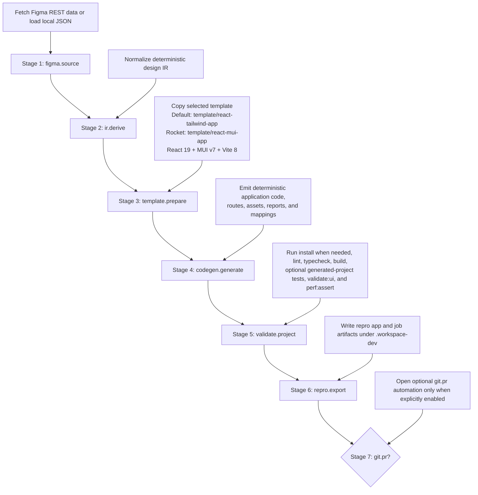

# Pipeline

`workspace-dev` executes a deterministic local Figma-to-code workflow with a fixed stage order and pipeline-selected bundled templates.
Internally, the pipeline is split into seven in-process stage services coordinated by a shared orchestrator.

## Stage flow

## Operational notes

- Pipeline kernel lives under `src/job-engine/pipeline/`:
  - `PipelineOrchestrator` handles stage order, skip behavior, status transitions, cancellation, and error mapping.
  - `StageArtifactStore` persists stage output references under `<jobDir>/.stage-store`.
- Stage services live under `src/job-engine/services/*-service.ts` and exchange data through artifact keys instead of direct service calls.
- Two plans are supported:
  - `submission`: all seven stages run in order.
  - `regeneration`: `figma.source` and `git.pr` are skipped by plan-level rules; remaining stages keep canonical order.
- `POST /workspace/submit` accepts authenticated Figma REST input, `local_json`, `figma_paste`, `figma_plugin`, and `hybrid` mode. Inline paste/plugin payloads are normalized into temp `local_json` artifacts before the canonical pipeline starts.
- `figma.source` consumes authenticated Figma REST input, `local_json`, and `hybrid` mode after submit-time normalization. In `hybrid`, REST fetch remains authoritative and optional MCP enrichment is merged in as artifact-backed hints for downstream derivation.
- `ir.derive` and `codegen.generate` stay deterministic by design; hybrid mode enriches deterministic derivation with MCP metadata but does not switch the runtime into LLM generation.
- `template.prepare` starts from the selected pipeline template: `default` uses `template/react-tailwind-app`; `rocket` uses the bundled React 19 + MUI v7 + Vite 8 seed in `template/react-mui-app`.
- `codegen.generate` emits the generated app theme artifacts under `src/theme/`: canonical `tokens.json`, CSS custom properties in `tokens.css`, and token coverage evidence in `token-report.json`. The `default` pipeline additionally emits `src/generated/layout-report.json` and `src/generated/semantic-component-report.json` for transparent layout and semantic fallback diagnostics.
- `validate.project` is the release-quality gate for generated output and can optionally run generated-project unit tests, UI validation, and performance assertions. It also emits the deterministic `quality-passport.json` evidence file for both `default` and `rocket` jobs.
- `git.pr` is opt-in and skipped for local-only runs and regeneration jobs.
- Standard stage artifact keys include: `figma.cleaned`, `design.ir`, `figma.analysis`, `storybook.catalog`, `storybook.evidence`, `storybook.tokens`, `storybook.themes`, `storybook.components`, `figma.library_resolution`, `component.match_report`, `generated.project`, `generation.metrics`, `validation.summary`, `pipeline.quality_passport`, `pipeline.quality_passport.file`, `repro.path`, `git.pr.status`.
- Required stage `reads` are enforced before execution. Optional reads declare conditionally consumed artifacts such as the storybook-first surface without breaking non-storybook runs.
- Public job fields such as `artifacts.*`, `generationDiff`, `inspector.qualityPassport`, and `gitPr` are projected from the stage store by the pipeline kernel rather than being mutated directly inside stage services. That projection includes the curated storybook-first artifact paths and quality-passport evidence when they are available.

## Maintainer authoring contract

Pipeline authors extend `workspace-dev` by choosing implementations behind the shared stages, not by changing the public stage graph.
For the end-to-end authoring, packaging, Rocket migration, and compatibility fallback runbook, see
[`docs/default-pipeline/pipeline-authoring-and-migration.md`](docs/default-pipeline/pipeline-authoring-and-migration.md).
The registry selects a pipeline definition and that definition returns submission, regeneration, and retry plans, but every returned plan must preserve the canonical seven-stage order:

1. `figma.source`
2. `ir.derive`
3. `template.prepare`
4. `codegen.generate`
5. `validate.project`
6. `repro.export`
7. `git.pr`

The canonical stage names are part of the public job contract. They appear in job status, logs, diagnostics, retry targets, inspector metadata, and artifact-backed public projection.
`PipelineOrchestrator` validates each plan before execution and rejects missing stages, duplicate stages, out-of-order stages, invalid stage names, and extra stages after the canonical end with `E_PIPELINE_PLAN_INVALID`.
This means `PipelineDefinition.buildSubmissionPlan`, `buildRegenerationPlan`, and `buildRetryPlan` are delegate-selection hooks, not arbitrary DAG builders.

Allowed pipeline-specific variation is intentionally narrow:

- Descriptor metadata: pipeline ID, display name, visibility, deterministic template metadata, supported source modes, and supported scopes.
- Stage implementations or delegates behind the existing stage names, such as a pipeline-specific template bundle inside `template.prepare`, generator inside `codegen.generate`, validation policy inside `validate.project`, or optional Git/PR runner inside `git.pr`.
- Plan-level skip rules that keep the stage in the canonical position, such as regeneration reusing an earlier source artifact while `figma.source` is marked skipped.
- Stage artifact contracts: required `reads`, optional reads, required `writes`, skip writes, optional writes, and dynamic artifact contracts when a stage conditionally consumes or emits artifacts.
- Stage input resolvers that adapt the selected pipeline, request mode, source scope, retry target, or persisted artifacts into the input expected by a stage service.

Shared stages remain shared even when their internals differ by pipeline.
Submission runs the full ordered sequence.
Regeneration keeps the same sequence and skips `figma.source` and `git.pr` by plan rule.
Retry keeps the same sequence and skips earlier retryable boundaries by reusing persisted artifacts.
The only retryable public boundaries today are `figma.source`, `ir.derive`, `template.prepare`, and `codegen.generate`.

Custom delegates are allowed when they preserve the owning stage name and the stage artifact contract.
Current delegate seams include:

- `createCodegenGenerateService` for generation, image export, streaming, component manifest, and Storybook-related generation dependencies under `codegen.generate`.
- `createValidateProjectService` and `runProjectValidationWithDeps` for project validation, validation feedback, diff persistence, visual capture, and comparison work under `validate.project`.
- `createGitPrService` for replacing the persisted Git/PR flow runner while keeping the public `git.pr` stage.

Delegate implementations must keep deterministic behavior, honor cancellation and error mapping, persist declared required artifacts, and use optional artifacts for pipeline-specific evidence that not every pipeline emits.
When a delegate creates output that should appear in the public job status or result, add an explicit artifact key and public projection rule; do not bypass the projection layer by mutating compatibility fields directly from a stage service.

Arbitrary new stage names, inserted stages, conditional DAG nodes, parallel branches, fan-out/fan-in execution, and new public retry boundaries are out of scope for the current pipeline-authoring contract.
Those changes would require a core redesign across `WorkspaceJobStageName`, retry contracts, job status shape, orchestrator ordering, cancellation, artifact dependency validation, UI/inspector assumptions, migration policy, and compatibility tests.
Until that redesign exists, new pipeline behavior must be expressed as delegates, artifact contracts, and skip rules inside the canonical stage order.

## Backend coverage gate

- `pnpm run test:coverage` is the authoritative backend coverage gate. It runs `c8 --all` across `src/**/*.ts`, then enforces the fixed threshold policy from [`scripts/check-coverage-thresholds.mjs`](scripts/check-coverage-thresholds.mjs).
- The current backend minimums are `lines >= 90%`, `statements >= 90%`, `functions >= 90%`, and `branches >= 85%`.
- [`src/job-engine.ts`](src/job-engine.ts) and [`src/job-engine/figma-source.ts`](src/job-engine/figma-source.ts) stay inside that global backend gate because they own queue orchestration, import governance, re-import handling, delta fetch reuse, and Figma transport retry behavior.
- Dev-gate and release-quality CI execute `pnpm run test:coverage` directly, so backend coverage-denominator changes are CI-visible on both promotion paths without a second policy layer.
- Any future backend coverage exclusion for a high-risk runtime boundary must be documented here with an explicit rationale, owner, and retirement condition before it is allowed to land.

## UI hotspot coverage

- `pnpm run ui:test:coverage` now runs two coverage passes:
  - the global UI gate for the broad UI surface
  - a hotspot-only pass for the high-complexity Issue `#586` modules
- The hotspot pass explicitly measures:
  - [`ui-src/src/features/workspace/workspace-page.tsx`](ui-src/src/features/workspace/workspace-page.tsx)
  - [`ui-src/src/features/workspace/inspector-page.tsx`](ui-src/src/features/workspace/inspector-page.tsx)
  - [`ui-src/src/features/workspace/inspector/InspectorScopeContext.tsx`](ui-src/src/features/workspace/inspector/InspectorScopeContext.tsx)
  - [`ui-src/src/features/visual-quality/visual-quality-page.tsx`](ui-src/src/features/visual-quality/visual-quality-page.tsx)
- The enforceable hotspot branch thresholds are `>=75%` for:
  - [`workspace-page.tsx`](ui-src/src/features/workspace/workspace-page.tsx)
  - [`inspector-page.tsx`](ui-src/src/features/workspace/inspector-page.tsx)
  - [`InspectorScopeContext.tsx`](ui-src/src/features/workspace/inspector/InspectorScopeContext.tsx)
  - [`visual-quality-page.tsx`](ui-src/src/features/visual-quality/visual-quality-page.tsx)
  - A global `branches: 75` fallback also applies to any file added to the hotspot pass that does not yet have a per-file entry.
- The only justified UI hotspot exceptions are:
  - [`ui-src/src/features/workspace/inspector/InspectorPanel.tsx`](ui-src/src/features/workspace/inspector/InspectorPanel.tsx)
    - Rationale: the panel still concentrates the broadest remaining branch fan-out in the UI surface, and the new interaction tests now cover its critical edit, sync, navigation, and diagnostics paths without yet making a `>=75%` threshold credible for the whole monolith.
    - Owner: `@oscharko-dev`.
    - Retirement condition: remove the exception after the panel is split into smaller audited submodules or its hotspot branch coverage reaches `>=75%` under the dedicated UI hotspot pass.
  - [`ui-src/src/lib/shiki-highlight.worker.ts`](ui-src/src/lib/shiki-highlight.worker.ts)
    - Rationale: the worker entrypoint is exercised through the worker client, but Vitest does not yet provide a deterministic harness for the worker message boundary without duplicating browser-worker setup inside the unit suite.
    - Owner: `@oscharko-dev`.
    - Retirement condition: remove the exception once the UI test suite includes a stable worker-harness test that executes the worker entrypoint through its real message protocol.
