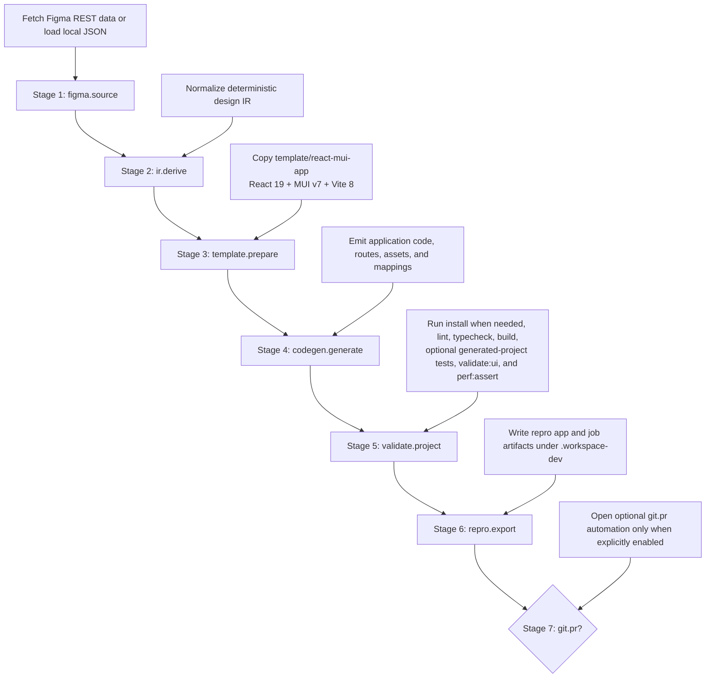

# Pipeline

`workspace-dev` executes a deterministic local Figma-to-code workflow with a fixed stage order and a bundled template stack.
Internally, the pipeline is split into seven in-process stage services coordinated by a shared orchestrator.

## Stage flow

## Operational notes

- Pipeline kernel lives under `src/job-engine/pipeline/`:
  - `PipelineOrchestrator` handles stage order, skip behavior, status transitions, cancellation, and error mapping.
  - `StageArtifactStore` persists stage output references under `<jobDir>/.stage-store`.
- Stage services live under `src/job-engine/services/*-service.ts` and exchange data through artifact keys instead of direct service calls.
- Two plans are supported:
  - `submission`: all seven stages run in order.
  - `regeneration`: `figma.source` and `git.pr` are skipped by plan-level rules; remaining stages keep canonical order.
- `figma.source` accepts authenticated Figma REST input, `local_json`, and `hybrid` mode. In `hybrid`, REST fetch remains authoritative and optional MCP enrichment is merged in as artifact-backed hints for downstream derivation.
- `ir.derive` and `codegen.generate` stay deterministic by design; hybrid mode enriches deterministic derivation with MCP metadata but does not switch the runtime into LLM generation.
- `template.prepare` always starts from the bundled React 19 + MUI v7 + Vite 8 seed in `template/react-mui-app`.
- `validate.project` is the release-quality gate for generated output and can optionally run generated-project unit tests, UI validation, and performance assertions.
- `git.pr` is opt-in and skipped for local-only runs and regeneration jobs.
- Standard stage artifact keys include: `figma.cleaned`, `design.ir`, `figma.analysis`, `storybook.catalog`, `storybook.evidence`, `storybook.tokens`, `storybook.themes`, `storybook.components`, `figma.library_resolution`, `component.match_report`, `generated.project`, `generation.metrics`, `validation.summary`, `repro.path`, `git.pr.status`.
- Required stage `reads` are enforced before execution. Optional reads declare conditionally consumed artifacts such as the storybook-first surface without breaking non-storybook runs.
- Public job fields such as `artifacts.*`, `generationDiff`, and `gitPr` are projected from the stage store by the pipeline kernel rather than being mutated directly inside stage services. That projection includes the curated storybook-first artifact paths when they are available.

## Coverage gate exclusions

- `pnpm run test:coverage` now excludes [`src/job-engine.ts`](src/job-engine.ts) and [`src/job-engine/figma-source.ts`](src/job-engine/figma-source.ts) from the global `c8` branch gate.
- These files remain covered by unit and integration tests, but they contain the highest branch fan-out in the repository because they combine queue orchestration, cancellation, retry classification, circuit-breaker state, and Figma transport error handling in a single runtime boundary.
- The branch gate was raised to `88%` by expanding deterministic renderer and utility coverage first. These two exclusions are the minimal fallback needed after that test work, and they must stay explicitly documented here so the exception remains auditable.

## UI hotspot coverage

- `pnpm run ui:test:coverage` now runs two coverage passes:
  - the global UI gate for the broad UI surface
  - a hotspot-only pass for the high-complexity Issue `#586` modules
- The hotspot pass explicitly measures:
  - [`ui-src/src/features/workspace/workspace-page.tsx`](ui-src/src/features/workspace/workspace-page.tsx)
  - [`ui-src/src/features/workspace/inspector-page.tsx`](ui-src/src/features/workspace/inspector-page.tsx)
  - [`ui-src/src/features/workspace/inspector/InspectorScopeContext.tsx`](ui-src/src/features/workspace/inspector/InspectorScopeContext.tsx)
  - [`ui-src/src/features/visual-quality/visual-quality-page.tsx`](ui-src/src/features/visual-quality/visual-quality-page.tsx)
- The enforceable hotspot branch thresholds are `>=75%` for:
  - [`workspace-page.tsx`](ui-src/src/features/workspace/workspace-page.tsx)
  - [`inspector-page.tsx`](ui-src/src/features/workspace/inspector-page.tsx)
  - [`InspectorScopeContext.tsx`](ui-src/src/features/workspace/inspector/InspectorScopeContext.tsx)
  - [`visual-quality-page.tsx`](ui-src/src/features/visual-quality/visual-quality-page.tsx)
- The only justified UI hotspot exceptions are:
  - [`ui-src/src/features/workspace/inspector/InspectorPanel.tsx`](ui-src/src/features/workspace/inspector/InspectorPanel.tsx)
    - Rationale: the panel still concentrates the broadest remaining branch fan-out in the UI surface, and the new interaction tests now cover its critical edit, sync, navigation, and diagnostics paths without yet making a `>=75%` threshold credible for the whole monolith.
    - Owner: `@oscharko-dev`.
    - Retirement condition: remove the exception after the panel is split into smaller audited submodules or its hotspot branch coverage reaches `>=75%` under the dedicated UI hotspot pass.
  - [`ui-src/src/lib/shiki-highlight.worker.ts`](ui-src/src/lib/shiki-highlight.worker.ts)
    - Rationale: the worker entrypoint is exercised through the worker client, but Vitest does not yet provide a deterministic harness for the worker message boundary without duplicating browser-worker setup inside the unit suite.
    - Owner: `@oscharko-dev`.
    - Retirement condition: remove the exception once the UI test suite includes a stable worker-harness test that executes the worker entrypoint through its real message protocol.
