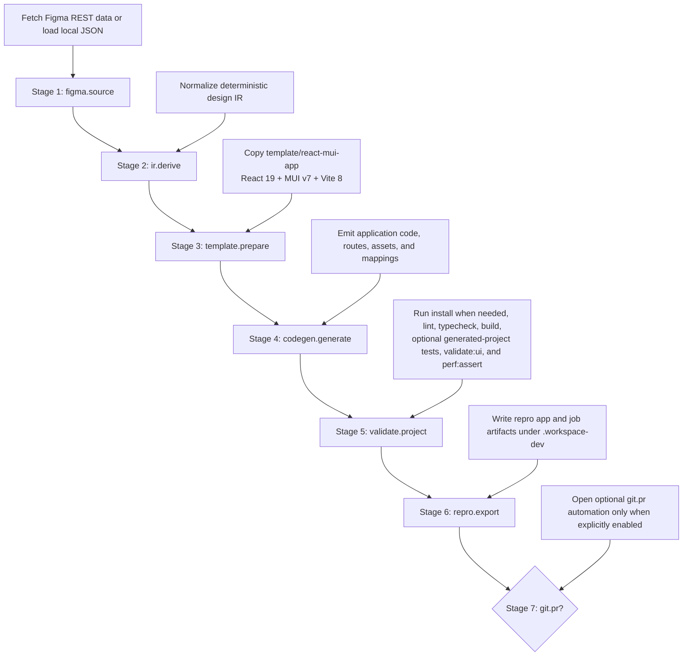

# Pipeline

`workspace-dev` executes a deterministic local Figma-to-code workflow with a fixed stage order and a bundled template stack.

## Stage flow

## Operational notes

- `figma.source` accepts either authenticated Figma REST input or local JSON input.
- `ir.derive` and `codegen.generate` stay deterministic by design; `workspace-dev` does not use hybrid or MCP generation modes.
- `template.prepare` always starts from the bundled React 19 + MUI v7 + Vite 8 seed in `template/react-mui-app`.
- `validate.project` is the release-quality gate for generated output and can optionally run generated-project unit tests, UI validation, and performance assertions.
- `git.pr` is opt-in and skipped for local-only runs and regeneration jobs.
